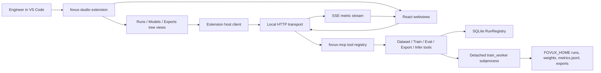

# Fovux Architecture

Fovux is a local-first CV workbench with two primary packages:

- `fovux-mcp`: a Python FastMCP server that owns tools, training subprocesses, the SQLite run
  registry, local HTTP/SSE transport, and artifact generation.
- `fovux-studio`: a VS Code extension that renders run, model, export, dataset, and training
  workflows over the local server.

## Data Flow

1. Studio reads `fovux.home` or `FOVUX_HOME` and starts `fovux-mcp serve --http --tcp` on demand.
2. The extension host uses the short-lived local HTTP client for health, list, detail, and tool
   invocation calls.
3. Webviews receive `baseUrl`, auth token, and initial state from the extension host.
4. Long-lived metric streaming stays in the webview through the SSE endpoint.
5. Training is launched as a detached subprocess, and the worker writes `metrics.jsonl`,
   `status.json`, weights, and logs under the run directory.

## Security Model

Fovux is local-first and private by default. The HTTP transport binds locally, requires bearer-token
auth for non-health endpoints, and stores the token under `FOVUX_HOME/auth.token`. The Studio
extension reads that token from the same filesystem and never asks the user to paste it into a UI.

The default operating model is intentionally simple:

- no hosted control plane
- no telemetry unless explicitly enabled
- no registry publishing without maintainer approval
- no background CI on Azure or GitLab mirrors

## Run Lifecycle

A normal detection workflow looks like this:

1. `dataset_inspect` validates local YOLO/COCO structure and sample metadata.
2. `train_start` creates a run directory, writes params atomically, and launches
   `python -m fovux.core.train_worker`.
3. The worker updates `metrics.jsonl`, `status.json`, and checkpoint weights.
4. Studio subscribes to `/runs/{id}/metrics` and overlays live chart series.
5. `eval_run`, `eval_error_analysis`, and `eval_per_class` diagnose model quality.
6. `export_onnx`, `export_tflite`, and `quantize_int8` produce deployment artifacts.
7. `benchmark_latency` and `quantize_report` help decide whether the artifact is ready.

## Extension Panels

The extension keeps the existing v2 core panel layout:

- Runs tree: training status, stop/resume/delete/tag/copy actions.
- Models tree: local checkpoints and model library artifacts.
- Exports tree: export history and reveal actions.
- Dashboard: selected run cards and metric overlays.
- Dataset Inspector: class distribution plus real bbox sample previews.
- Training Launcher: preset-based guarded training form.
- Export Wizard: target-device guidance for ONNX/TFLite/INT8 flows.
